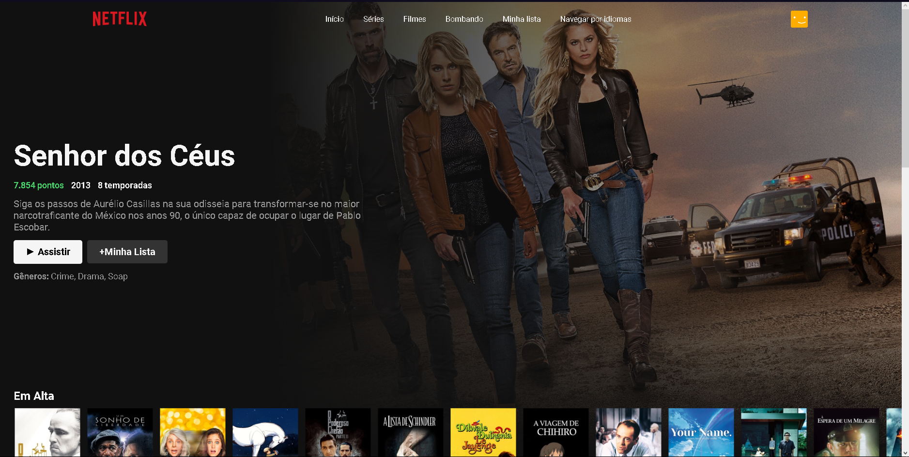
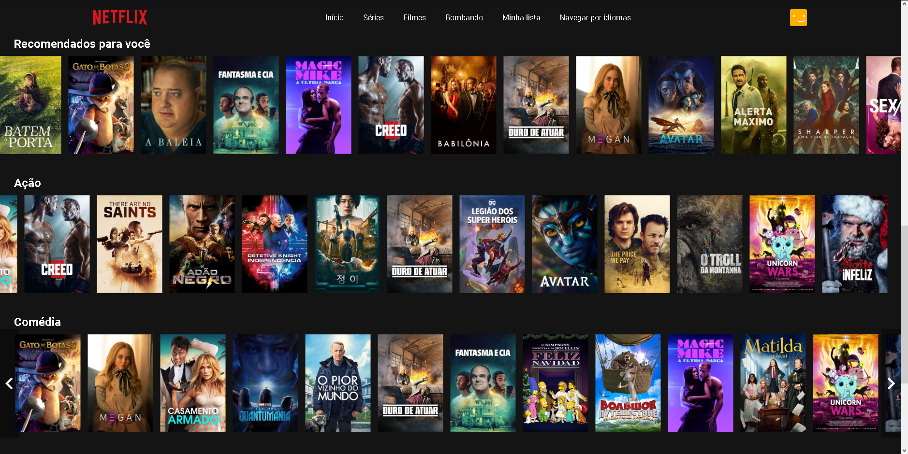

# Clone da Netflix

Projeto desenvolvido utilizando React + Typescript, além dos dados da API do Movie Database.

- [Link do Projeto](https://moraiskaua-netflix-clone.netlify.app)

### Instalar:

- `npm install`

### Rodar:

- `npm run dev`

#

## Prints:

 

